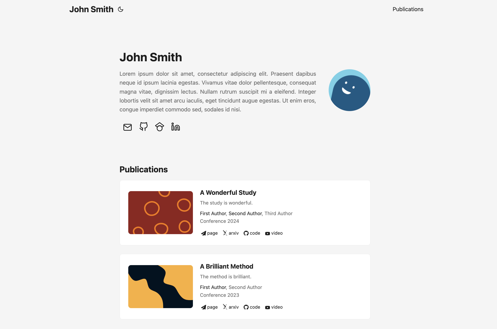

<h1 align=center>Hugo PaperMod-Academics | <a href="https://shinying.github.io/" rel="nofollow">Example</a></h1>

> Hugo PaperMod-Academics is a theme based on [Hugo PaperMod](https://github.com/adityatelange/hugo-PaperMod).<br>This project adapts PaperMod's home-info mode for publication showcases.

**Example site** can be found [here](https://shinying.github.io), with its source [here](https://github.com/shinying/shinying.github.io).



---

## Install/Update 📥

Read PaperMod Wiki For More Details => **[PaperMod - Installation](https://github.com/adityatelange/hugo-PaperMod/wiki/Installation)**

## Usage 🔥

To list your publications,

1. Make a directory `pubs` under `content`. 

2. Make a publication file `example_pub.md` under `pubs`. For example,
   
   ```markdown
   ---
   title: your publication title
   date: date
   venue: conference or journal
   authors:
       - name: first author's name
         home: first author's web page
       - name: second author's name
       ...
   selected: true or false
   arxiv: url
   page: url
   code: url
   video: url
   cover:
       image: path/to/image.jpg
   summary: short description
   ---
   ```
   
   Items with no value will be ignored. If you want to show only selected publications in your home page, set `selected: true` and `ShowOnlySelectedPubs: true` in your [site parameters](https://gohugo.io/getting-started/configuration/).

3. If you want an isolated archival page listing all publications, make a file `_index.md` under `pubs` and set [menu](https://gohugo.io/content-management/menus). The content of `_index.md` should be
   
   ```markdown
   ---
   title: Publications (whatever you want)
   layout: publications
   ---
   ```

---

* The arXiv icon is from [Academicons](https://jpswalsh.github.io/academicons/) licensed under the [SIL OFL 1.1](https://scripts.sil.org/OFL).
